# PostgreSQL Endpoint Manager — Connection Flow

## High-level diagram

```mermaid
%%{init: {"flowchart": {"nodeSpacing": 50, "rankSpacing": 75}, "themeVariables": {"fontSize": "14px"}}}%%
flowchart LR
  subgraph Cron
    CJ[CronJob / Scheduled Job]
  end

  CJ -->|runs| Script["postgres-endpoint-manager.py"]

  Script -->|reads| Env["ENV: PG_NODES, RW_SERVICE, RO_SERVICE, PG* settings"]

  Script -->|for each node| NodeCheck["Check each PostgreSQL node"]

  NodeCheck -->|pg_isready| Connectivity["Connectivity check (pg_isready)"]
  Connectivity -->|ok| Recovery["Query: SELECT pg_is_in_recovery() via psql"]
  Connectivity -->|fail| MarkDown["Mark node DOWN (no status)"]

  Recovery -->|f| Primary["Primary"]
  Recovery -->|t| Standby["Standby"]
  Recovery -->|error| MarkUnknown["Unknown / WARN"]

  Primary & Standby & MarkDown & MarkUnknown -->|collect| Verifier["verify_topology() — parallel"]
  Verifier -->|result| Topology["Verified topology (primary_ip, standby_ips)"]

  Topology -->|read| Stored["Get stored topology annotation (Endpoints RW service)"]
  Stored -->|compare| Compare["Compare stored vs current signature"]

  Compare -->|no change| Skip["Skip endpoint updates"]
  Compare -->|changed| CheckPrim["Check single-primary & sanity"]

  CheckPrim -->|multiple primaries| ErrorMP["Log ERROR: multiple primaries; abort updates"]
  CheckPrim -->|no primary| ErrorNoP["Log ERROR: no primary; abort updates"]
  CheckPrim -->|ok| BuildPayload["Build Endpoints payload (dict)"]

  BuildPayload -->|patch| K8sAPI["Kubernetes API: patch_namespaced_endpoints"]
  K8sAPI -->|404| Create["create_namespaced_endpoints (if not found)"]
  K8sAPI & Create -->|success| LogUpdate["Log success & update annotations"]

  LogUpdate -->|complete| Finish["Run completes — next cron run repeats"]

  %% External clients
  subgraph Clients
    App["Application clients"]
  end
  App -->|DNS/Service| RW_SERVICE["RW Service -> Endpoints -> Primary IP"]
  App -->|DNS/Service| RO_SERVICE["RO Service -> Endpoints -> Standby IPs"]
```


```

## Notes / Legend

- Script: `scripts/postgres-endpoint-manager.py` run as a CronJob (short-lived process).
- Node checks:
  - `pg_isready` first, then `psql -c "SELECT pg_is_in_recovery();"` to determine role.
  - Results collected in parallel via `ThreadPoolExecutor`.
- Topology verification:
  - Returns `{'primary_ip': ip, 'primary_name': name, 'standby_ips': [...]}`.
  - If multiple primaries are detected, the script logs an explicit error and aborts endpoint updates.
  - If no primary is found, the script logs an error and aborts endpoint updates.
- Stored topology:
  - Read from the RW service Endpoints annotation `postgres.discovery/last-topology`.
  - Only when the signature changes (and sanity checks pass) the script updates Endpoints.
- Endpoint update flow:
  - Build a plain dictionary body (to avoid Kubernetes client model mismatch across package versions).
  - Attempt `patch_namespaced_endpoints`; on `ApiException` with HTTP 404, call `create_namespaced_endpoints`.
  - Update annotation `postgres.discovery/last-topology` and `postgres.discovery/last-update`.
- Failures and safety:
  - Multiple primaries -> error log + no update.
  - No primary or all nodes down -> error log + no update.
  - Kubernetes client missing or config load failure -> process exits with error.

## Suggested additions
- Add a unit test for `verify_topology()` to assert behavior when multiple primaries are returned.
- Add a small Kubernetes Role/RoleBinding to ensure the CronJob service account has `get`, `patch`, `create` rights on `endpoints`.
- Optional: render this Merlin/mermaid diagram to PNG for documentation site.

---
